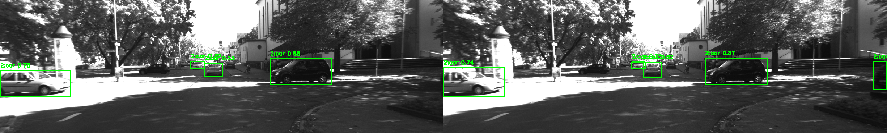
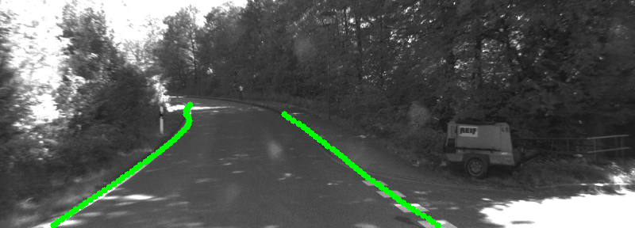

# Autonomous Mobility

KITTI 데이터셋을 기반으로 차량 주행 환경에서의 객체 탐지(Object Detection)와 차선 검출(Lane Detection)을 구현한 프로젝트입니다.

본 프로젝트는 자율주행 인식(Perception) 과정에서 중요한 두 가지 요소를 중심으로 구성되어 있습니다.

- 객체 탐지: 주행 환경에서 차량, 보행자 등 주요 객체 인식

- 차선 검출: 도로 구조 및 차선 위치 인식

각 기능에 대한 상세 구현 및 결과는 하위 디렉토리의 README에서 확인할 수 있습니다.


## Project Structure

```bash
.
├── .gitignore
├── README.md
├── requirements.txt
├── object_detection/
│   ├── object_detection.py
│   ├── compare_frame.py
│   ├── yolov8n.pt                 # YOLO model (ignored)
│   ├── YOLO_left.mp4              # Result video (ignored)
│   ├── YOLO_right.mp4             # Result video (ignored)
│   ├── left_frames/               # Extracted frames (ignored)
│   ├── right_frames/              # Extracted frames (ignored)
│   └── compare_frames/            # Comparison frames (ignored)
│
├── lane_detection/
│   ├── lane_detection.ipynb
│   ├── Ultra-Fast-Lane-Detection/ # External lane detection repo (ignored)
│   └── outputs/                   # Lane detection results (ignored)
│
└── auto_env/                      # Python virtual environment (ignored)
```

---

## Results

### Object Detection


### Lane Detection
