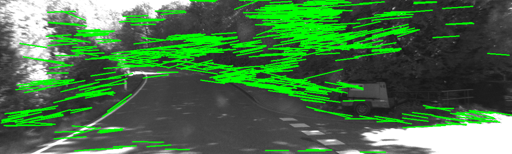
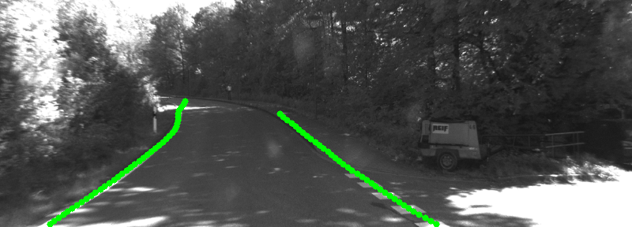

# Lane Detection

차선 검출을 위해 전통적인 방법과 딥러닝 기반 방법을 비교 분석합니다.

---

## Overview

본 모듈에서는 KITTI Sequence 09 데이터를 기반으로 차선 검출을 수행하고, 두 가지 접근 방식을 비교합니다.

- Bayesian 기반 도로 영역 분류
- 딥러닝 기반 차선 검출 (UFLD)

---

## Setup

```bash
pip install -r requirements.txt
```

차선 검출에 사용하는 Ultra-Fast-Lane-Detection 코드는 노트북 안에서 설치하지 않고, 아래처럼 별도로 클론해서 사용합니다.

```bash
cd lane_detection
git clone https://github.com/cfzd/Ultra-Fast-Lane-Detection.git
```

클론이 끝나면 pretrained 모델 파일을 직접 다운로드해야 합니다. 모델은 Ultra-Fast-Lane-Detection README의 `Trained models` 섹션에 있는 Tusimple-18 모델 링크에서 받을 수 있습니다.

- 모델 다운로드 위치: https://github.com/cfzd/Ultra-Fast-Lane-Detection
- 사용할 모델: `Tusimple` pretrained ResNet-18 model
- 저장 파일명: `tusimple_18.pth`

다운로드한 모델은 아래 경로에 `models` 폴더를 만든 뒤 넣어줍니다.

```bash
mkdir -p lane_detection/Ultra-Fast-Lane-Detection/models
```

최종 모델 파일 위치는 다음과 같아야 합니다.

```bash
lane_detection/
└── Ultra-Fast-Lane-Detection/
    └── models/
        └── tusimple_18.pth
```

`Ultra-Fast-Lane-Detection/`, `models/`, 결과 이미지와 영상 파일은 용량이 크기 때문에 Git에는 올리지 않고 `.gitignore`로 제외합니다.

---

## Method

### 1. Bayesian 기반 차선 검출
- 픽셀 밝기 분포를 기반으로 도로 영역 분류
- ROI(사다리꼴 영역)를 활용한 후보 추출

### 2. UFLD 기반 차선 검출
- CNN 기반 딥러닝 모델
- row anchor 기반 차선 위치 예측
- 후처리를 통한 차선 좌표 복원

---

## Lane Detection Results (Sequence 09 - Frame 000013.png)

### Bayesian-based detection


### UFLD-based detection


---

## Analysis

Bayesian 방식은 조명 변화 및 배경 질감에 영향을 크게 받아 오검출이 발생하는 반면,  
UFLD 모델은 차선의 구조적 특징을 학습하여 보다 안정적인 결과를 보입니다.
