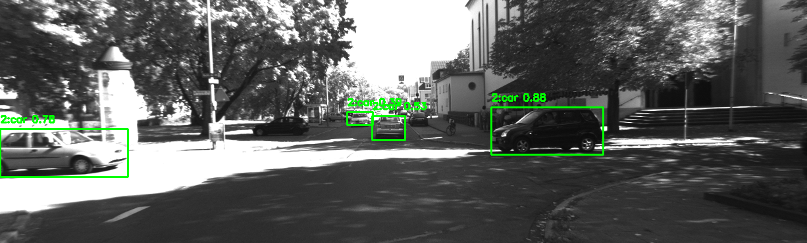
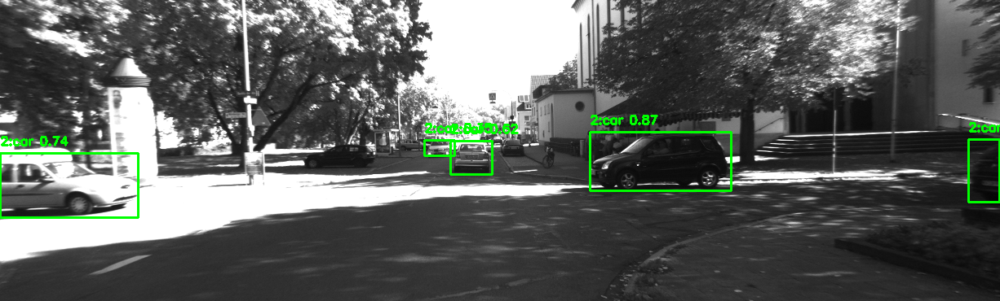

# Object Detection

KITTI Odometry Dataset을 기반으로 YOLOv8 모델을 활용하여 주행 환경 내 객체 탐지를 수행하고, 좌우 스테레오 카메라 간 탐지 결과를 비교 분석합니다.

---

## Overview

본 모듈에서는 차량 주행 환경에서의 객체 인식을 위해 YOLO 기반 객체 탐지 모델을 적용하였습니다.  
특히 KITTI Sequence 08의 좌우 카메라 영상을 각각 처리하여, 동일한 장면에서도 카메라 시점에 따라 탐지 결과가 어떻게 달라지는지를 분석하는 것을 목표로 합니다.

---

## Dataset

- KITTI Odometry Dataset
- Sequence 08 (Stereo camera images)
  - `image_0`: left camera
  - `image_1`: right camera

---

## Method

- 사전 학습된 YOLOv8n 모델을 활용한 객체 탐지
- COCO 데이터셋 기준 특정 클래스만 필터링하여 탐지 수행

### Target Classes
| Class ID | Category |
|----------|---------|
| 0 | person |
| 1 | bicycle |
| 2 | car |
| 7 | truck |

- 각 객체에 대해 bounding box, class ID, confidence score 시각화
- 프레임 단위 결과를 영상으로 변환 (left / right)

---

## Results

### Left Camera Detection (Sequence 08 - Frame 000007)

### Right Camera Detection (Sequence 08 - Frame 000007)

---

## Analysis

객체 탐지 결과를 분석한 결과, 좌우 스테레오 카메라 간 동일한 장면에서도 탐지 결과에 차이가 발생하는 것을 확인할 수 있었다.

- 일부 프레임에서는 한쪽 카메라에서는 객체가 탐지되지만, 다른 카메라에서는 탐지되지 않는 경우가 존재하였다.
- 이는 카메라 시점 차이에 의해 객체의 크기, 위치, 가시성이 달라지기 때문으로 해석된다.
- 특히 화면 가장자리에 위치한 객체나 부분적으로 가려진 객체의 경우 탐지 누락이 발생하는 경향이 있었다.
- 조명 변화나 그림자에 의해 특정 카메라에서 confidence score가 낮아지는 현상도 관찰되었다.

이러한 결과를 통해, 단일 카메라 기반 객체 탐지의 한계와 함께 스테레오 환경에서의 인식 차이를 확인할 수 있었다.

---

## Output

- `YOLO_left.mp4`: 왼쪽 카메라 탐지 결과 영상
- `YOLO_right.mp4`: 오른쪽 카메라 탐지 결과 영상